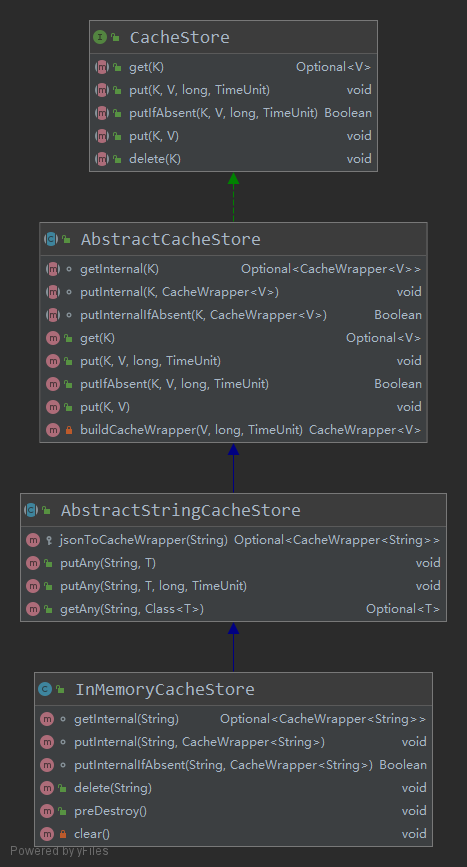

# 工程简介

**这是我个人对[Halo](https://github.com/halo-dev/halo) 项目的学习项目，尝试梳理一下这个项目的设计思路。**

* [数据缓存模块](#数据缓存模块)
    * [缓存类设计](#缓存类设计)
    * [配置中定义缓存实现类](#配置中定义缓存实现类)
* [登录模块(安全模块)](#登录模块安全模块)
    * [使用ThreadLocal存储用户信息](#使用threadlocal存储用户信息)
    * [使用自定义Token](#使用自定义token)
        * [登陆成功时构建token并存储到CacheStore中](#登陆成功时构建token并存储到cachestore中)
        * [过滤器中将用户信息存到ThreadLocal](#过滤器中将用户信息存到threadlocal)
* [全局异常处理](#全局异常处理)
* [AOP记录接口日志](#aop记录接口日志)
* [观察者模式\-发布订阅模式](#观察者模式-发布订阅模式)
    * [实现SpringBoot事件监听机制](#实现springboot事件监听机制)
        * [定义注册事件](#定义注册事件)
        * [定义监听器](#定义监听器)
        * [事件发布者发布事件](#事件发布者发布事件)

## 数据缓存模块

### 缓存类设计

Halo项目中数据缓存有三种实现，可以在配置文件中自定义使用哪种，分别是Inmemory本地内存、redis数据库、level-db数据库。作者对CacheStore类的设计非常值得学习。这是相关的类图：



1. **CacheStore**：顶层接口是CacheStore，定义了5个基础的数据操作方法。

2. **AbstractCacheStore**：抽象类AbstractCacheStore实现CacheStore接口并定义了put/getInternal方法实现对CacheWrapper对象的数据操作。

   CacheWrapper对象封装了具体数据以及数据的创建时间、过期时间：

   ```java
   class CacheWrapper<V> implements Serializable {
       /**
        * Cache data
        */
       private V data;
   
       /**
        * Expired time.
        */
       private Date expireAt;
   
       /**
        * Create time.
        */
       private Date createAt;
   }
   ```

3. **AbstractStringCacheStore**：抽象类AbstractStringCacheStore继承自AbstractCacheStore类定义了put/getAny方法实现了将任意类型数据与String数据进行转换后再操作的功能。

   ```java
   public <T> void putAny(String key, T value) {
           try {
               put(key, JsonUtils.objectToJson(value));
           } catch (JsonProcessingException e) {
               throw new ServiceException("Failed to convert " + value + " to json", e);
           }
       }
   public <T> void putAny(@NonNull String key, @NonNull T value, long timeout, @NonNull TimeUnit timeUnit) {
           try {
               put(key, JsonUtils.objectToJson(value), timeout, timeUnit);
           } catch (JsonProcessingException e) {
               throw new ServiceException("Failed to convert " + value + " to json", e);
           }
       }
   
   public <T> Optional<T> getAny(String key, Class<T> type) {
       Assert.notNull(type, "Type must not be null");
   
       return get(key).map(value -> {
           try {
               return JsonUtils.jsonToObject(value, type);
           } catch (IOException e) {
               log.error("Failed to convert json to type: " + type.getName(), e);
               return null;
           }
       });
   }
   ```

4. **InMemoryCacheStore**/**RedisCacheStore**等实现类只需重写实现put/getInternal方法以及delete方法即可。

### 配置中定义缓存实现类

```java
@Bean
@ConditionalOnMissingBean
public AbstractStringCacheStore stringCacheStore() {
    AbstractStringCacheStore stringCacheStore;
    switch (haloProperties.getCache()) {
        case "level":
            stringCacheStore = new LevelCacheStore(this.haloProperties);
            break;
        case "redis":
            stringCacheStore = new RedisCacheStore(this.haloProperties);
            break;
        case "memory":
        default:
            //memory or default
            stringCacheStore = new InMemoryCacheStore();
            break;
    }
    log.info("Halo cache store load impl : [{}]", stringCacheStore.getClass());
    return stringCacheStore;

}
```


## 登录模块(安全模块)

### 使用ThreadLocal存储用户信息

由于传统的将用户信息存放在Session中有许多缺点，例如需要从HttpServletRequest中获取session再获取信息十分繁琐，业务层等代码中获取用户信息还需Controller层从session中获取后以方法参数的方式传递过来等。放弃使用Session，当前登录的用户信息存储在自定义的ThreadLocal本地线程局部变量中，ThreadLocal中存储的用户信息的**生命周期范围是每次请求**，在每次请求前的AdminAuthenticationFilter验证过滤器中创建，每次请求结束后销毁。

```java
public class SecurityContextHolder {
    private static final ThreadLocal<SecurityContext> CONTEXT_HOLDER = new ThreadLocal<>();
    @NonNull
    public static SecurityContext getContext() {
        ...
    }
    /**
     * set context.
     */
    public static void setContext(@Nullable SecurityContext context) {
        CONTEXT_HOLDER.set(context);
    }
    /**
     * remove context.
     */
    public static void clearContext() {
        CONTEXT_HOLDER.remove();
    }
}
```

### 使用自定义Token

在用户登录成功后，使用UUID生成一个AccessToken和RefreshToken，与过期信息一并存储在CacheStore中。给用户返回一个AccessToken和一个RefreshToken以及过期时间，以后用户在访问需验证的接口时，在Header或请求参数中带上AccessToken，在过滤器中解析请求中的AccessToken，然后使用AccessToken从**CacheStore**中获取用户信息并存储到ThreadLocal中。这样，在后续可以直接从ThreadLocal中获取用户信息。

```java
@Data
public class AuthToken {
    /**
     * access_token
     */
    @JsonProperty("access_token")
    private String accessToken;
    /**
     * refresh_token
     */
    @JsonProperty("refresh_token")
    private String refreshToken;
    /**
     * Expired in. (seconds)
     */
    @JsonProperty("expired_in")
    private int expiredIn;
}
```

#### 登陆成功时构建token并存储到CacheStore中

```java
private AuthToken buildAuthToken(@NonNull User user) {
        Assert.notNull(user, "User must not be null");

        AuthToken authToken = new AuthToken();

        authToken.setAccessToken(UUIDUtils.randomUUIDWithoutDash());
        authToken.setRefreshToken(UUIDUtils.randomUUIDWithoutDash());
        authToken.setExpiredIn(ACCESS_TOKEN_EXPIRED_SECONDS);

        // Cache those tokens with userId as key
        cacheStore.putAny(SecurityUtils.buildTokenAccessKeyWithUser(user), authToken.getAccessToken(), ACCESS_TOKEN_EXPIRED_SECONDS, TimeUnit.SECONDS);
        cacheStore.putAny(SecurityUtils.buildRefreshTokenAccessKeyWithUser(user), authToken.getRefreshToken(), REFRESH_TOKEN_EXPIRED_DAYS, TimeUnit.DAYS);

        // Cache those tokens with userId as value
        cacheStore.putAny(SecurityUtils.buildAccessTokenKey(authToken.getAccessToken()), user.getId(), ACCESS_TOKEN_EXPIRED_SECONDS, TimeUnit.SECONDS);
        cacheStore.putAny(SecurityUtils.buildRefreshTokenKey(authToken.getRefreshToken()), user.getId(), REFRESH_TOKEN_EXPIRED_DAYS, TimeUnit.DAYS);

        return authToken;
    }
```

#### 过滤器中将用户信息存到ThreadLocal

```java
public class AdminAuthenticationFilter extends AbstractAuthenticationFilter {
@Override
    protected void doAuthenticate(HttpServletRequest request, HttpServletResponse response, FilterChain filterChain) throws ServletException, IOException {
        // Get token from request
        String token = getTokenFromRequest(request);

        if (StringUtils.isBlank(token)) {
            throw new AuthenticationException("未登录，请登录后访问");
        }
        // Get user id from cache
        Optional<Integer> optionalUserId = cacheStore.getAny(SecurityUtils.buildAccessTokenKey(token), Integer.class);

        if (!optionalUserId.isPresent()) {
            throw new AuthenticationException("Token 已过期或不存在").setErrorData(token);
        }
        // Get the user
        User user = userService.getById(optionalUserId.get());
        // Build user detail
        UserDetail userDetail = new UserDetail(user);
        // Set security
        SecurityContextHolder.setContext(new SecurityContextImpl(new AuthenticationImpl(userDetail)));
        // Do filter
        filterChain.doFilter(request, response);
    }
}
```

```java
public abstract class AbstractAuthenticationFilter extends OncePerRequestFilter {
@Override
    protected void doFilterInternal(HttpServletRequest request, HttpServletResponse response, FilterChain filterChain) throws ServletException, IOException {
        try {
            // Do authenticate 调用上面的方法
            doAuthenticate(request, response, filterChain);
        } catch (AbstractBaseException e) {
            getFailureHandler().onFailure(request, response, e);
        } finally {
            //请求完成。清理ThreadLocal中的用户信息，防止内存泄漏
            SecurityContextHolder.clearContext();
        }
    }
}
```

## 全局异常处理

1. 自定义抽象类AbstractHaloException继承自RuntimeException

   ```java
   public abstract class AbstractHaloException extends RuntimeException {
       private Object errorData;
   
       public AbstractHaloException(String message) {
           super(message);
       }
       public AbstractHaloException(String message, Throwable cause) {
           super(message, cause);
       }
       /**
        * Http status code
        */
       @NonNull
       public abstract HttpStatus getStatus();
   
       @Nullable
       public Object getErrorData() {
           return errorData;
       }
       @NonNull
       public AbstractHaloException setErrorData(@Nullable Object errorData) {
           this.errorData = errorData;
           return this;
       }
   }
   ```

2. 自定义异常NotFoundException继承AbstractHaloException类

   ```java
   public class NotFoundException extends AbstractHaloException {
   
       public NotFoundException(String message) {
           super(message);
       }
   
       public NotFoundException(String message, Throwable cause) {
           super(message, cause);
       }
   
       @Override
       public HttpStatus getStatus() {
           return HttpStatus.NOT_FOUND;
       }
   }
   ```

3. 在代码中catch到异常后throw

4. 使用@RestControllerAdvice注解定义一个全局异常处理类,捕获到异常后，获取异常信息并返回

   ```java
   @RestControllerAdvice(value = {"run.halo.app.controller.admin.api", "run.halo.app.controller.content.api"})
   @Slf4j
   public class ControllerExceptionHandler {
       @ExceptionHandler(AbstractHaloException.class)
       public ResponseEntity<BaseResponse<?>> handleHaloException(AbstractHaloException e) {
           BaseResponse<Object> baseResponse = handleBaseException(e);
           baseResponse.setStatus(e.getStatus().value());
           baseResponse.setData(e.getErrorData());
           return new ResponseEntity<>(baseResponse, e.getStatus());
       }
       
       @ExceptionHandler(Exception.class)
       @ResponseStatus(HttpStatus.INTERNAL_SERVER_ERROR)
       public BaseResponse<?> handleGlobalException(Exception e) {
           BaseResponse<?> baseResponse = handleBaseException(e);
           HttpStatus status = HttpStatus.INTERNAL_SERVER_ERROR;
           baseResponse.setStatus(status.value());
           baseResponse.setMessage(status.getReasonPhrase());
           return baseResponse;
       }
      
       private <T> BaseResponse<T> handleBaseException(Throwable t) {
           Assert.notNull(t, "Throwable must not be null");
   
           BaseResponse<T> baseResponse = new BaseResponse<>();
           baseResponse.setMessage(t.getMessage());
   
           if (log.isDebugEnabled()) {
               log.error("Captured an exception:", t);
               baseResponse.setDevMessage(ExceptionUtils.getStackTrace(t));
           } else {
               log.error("Captured an exception: [{}]", t.getMessage());
           }
   
           return baseResponse;
       }
       
   }
   ```

## AOP记录接口日志

```java
@Aspect
@Component
@Slf4j
public class ControllerLogAop {
    @Pointcut("execution(* *..*.*.controller..*.*(..))")
    private void controller() {
    }
    @Around("controller()")
    public Object controllerLog(ProceedingJoinPoint joinPoint) throws Throwable {
        //被织入advice的类名
        String className = joinPoint.getTarget().getClass().getSimpleName();
        //方法名
        String methodName = joinPoint.getSignature().getName();
        //方法参数
        Object[] args = joinPoint.getArgs();

        HttpServletRequest request = ServletUtils.getCurrentRequest().orElseThrow(() -> new BadRequestExpection("无法获取当前httpServletRequest"));

        //记录请求日志
        printRequestLog(request, className, methodName, args);

        TimeInterval timer = DateUtil.timer();
        Object returnObj = joinPoint.proceed();
        long cost = timer.interval();
        //记录响应日志
        printResponseLog(className, methodName, args, returnObj, cost);

        return returnObj;
    }
}
```

## 观察者模式-发布订阅模式

系统中观察者模式的运用之一是：用户登录成功、失败、注销时，异步记录到日志表中，这一过程使用的SpringBoot提供的事件监听机制。观察者模式的定义：**在对象之间定义一个一对多的依赖，当一个对象状态改变的时候，所有依赖的对象都会自动收到通知**。

观察者模式和发布订阅模式是有一些区别，主要有以下几点：

- 观察者模式：观察者订阅主题，主题也维护观察者的记录，而后者：**发布者和订阅者不需要彼此了解**，而是在消息队列或代理的帮助下通信，实现松耦合。
- 观察者模式主要以同步方式实现，即某个事件发生时，由Subject调用所有监听器的对应方法，发布订阅模式则主要使用消息队列异步实现。

#### 实现SpringBoot事件监听机制

1. ##### 定义注册事件

   继承ApplicationEvent类

   ```java
   public class LogEvent extends ApplicationEvent {
       @Getter
       private final transient LogParam logParam;
       public LogEvent(Object source, LogParam logParam) {
           super(source);
   		...
           this.logParam = logParam;
       }
       public LogEvent(Object source, String logKey, LogType type, String content) {
           this(source, new LogParam(logKey, type, content));
       }
   }
   ```

2. ##### 定义监听器

   有两种方式：

    - 使用@EventListener注解

      ```java
      @Component
      public class LogEventListener {
      
          private final LogService logService;
      
          public LogEventListener(LogService logService) {
              this.logService = logService;
          }
          @EventListener
          @Async
          public void onApplicationEvent(LogEvent event) {
              // Convert to log
              Log logToCreate = event.getLogParam().convertTo();
              // Create log
              logService.create(logToCreate);
          }
      }
      ```

    - 实现EventListen接口

      ```java
      @Component
      public class LogEventListener implements ApplicationListener<LogEvent> {
      
          private final LogService logService;
      
          public LogEventListener(LogService logService) {
              this.logService = logService;
          }
          @Override
          @Async
          public void onApplicationEvent(LogEvent event) {
              // Convert to log
              Log logToCreate = event.getLogParam().convertTo();
              // Create log
              logService.create(logToCreate);
          }
      }
      ```

3. ##### 事件发布者发布事件

   需发布事件的类中注入事件发布者

   ```java
   @Service
   @Slf4j
   public class UserServiceImpl extends ServiceImpl<UserMapper, User> implements UserService {
       private final ApplicationEventPublisher eventPublisher;
       public UserServiceImpl(ApplicationEventPublisher eventPublisher) {
           this.eventPublisher = eventPublisher;
       }
       @Override
       public AuthToken loginCheck(@NonNull final LoginParam loginParam) {
   		登录成功逻辑...
           // Log it then login successful
           eventPublisher.publishEvent(new LogEvent(this, user.getUsername(), LogType.LOGGED_IN, user.getNickname()));
           //Generate accessToken
           return buildAuthToken(user);
       }
   ```


